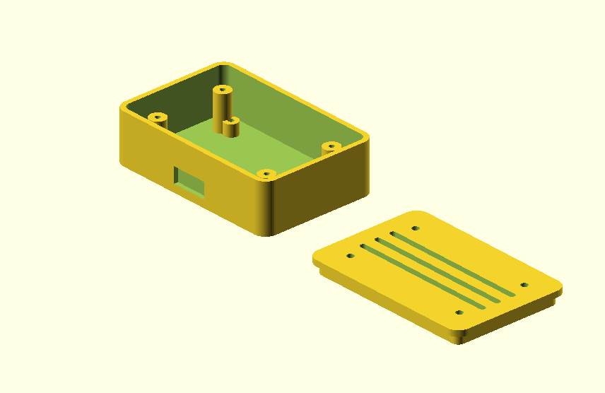
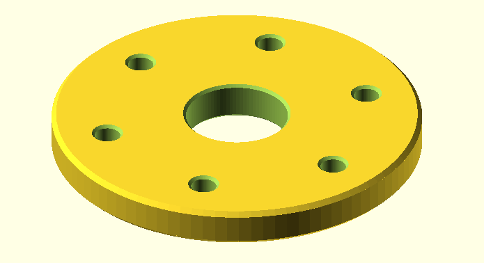
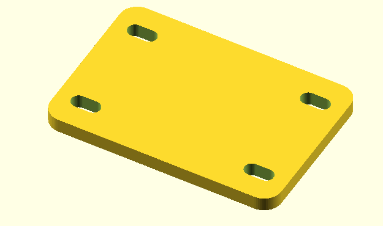

# Parametric OpenSCAD Projects

A collection of reusable and fully parametric CAD generators developed in OpenSCAD.

The project focuses on modular design, geometric automation and the creation of configurable components that can be adapted without manually remodelling each part.

## Project Overview

This repository contains a collection of parametric 3D models and reusable geometric modules developed with OpenSCAD.

The models are controlled through configurable parameters, allowing their dimensions, hole patterns and structural characteristics to be modified directly through code.

## Projects

### Parametric Electronics Enclosure



A configurable enclosure designed for electronic components and rapid prototyping.

Configurable properties include:

* Width, length and height
* Wall thickness
* Corner radius
* Internal space
* Mounting dimensions

### Parametric Flange Generator



A configurable generator for circular flanges.

Configurable properties include:

* External diameter
* Internal diameter
* Flange thickness
* Number of mounting holes
* Hole diameter
* Bolt circle diameter

### Parametric Mounting Plate



A configurable mounting plate generator with customizable dimensions and hole patterns.

Configurable properties include:

* Plate width and length
* Plate thickness
* Corner radius
* Hole diameter
* Horizontal and vertical hole spacing

## Reusable Toolbox

The `toolbox.scad` file contains reusable modules for common geometric operations and components, including:

* Rounded plates
* Slotted holes
* Four-corner hole patterns
* Circular hole patterns
* Hollow electronics enclosures

These modules reduce code duplication and make it easier to create new parametric models.

## Technical Concepts

This project applies the following concepts:

* Parametric CAD modelling
* Constructive Solid Geometry
* Boolean operations
* Geometric transformations
* Modular programming
* Reusable functions and modules
* Circular and symmetric pattern generation
* Input validation using assertions
* Git version control

## Technologies

* OpenSCAD
* Git
* GitHub
* Parametric CAD
* 3D modelling
* Rapid prototyping

## Repository Structure

```text
.
├── Projects/
│   ├── Electronics_enclosure_parametric.scad
│   ├── Flange_generator_parametric.scad
│   └── Mounting_plate_generator_parametric.scad
├── Progress/
├── toolbox.scad
└── README.md
```

## How to Run the Project

1. Install OpenSCAD.
2. Clone or download this repository.
3. Open one of the `.scad` files inside the `Projects` directory.
4. Change the parameters at the beginning of the file.
5. Press `F5` to preview the model.
6. Press `F6` to fully render the model.
7. Export the result as an STL file when required.

## Clone the Repository

```bash
git clone https://github.com/lgg1303/parametric-openscad-projects.git
```

## Possible Applications

The parametric models can be adapted for:

* Electronics prototyping
* Custom mounting systems
* Mechanical assemblies
* 3D-printed components
* Product design experiments
* CAD automation

## Author

**Lourenço Guerreiro**

GitHub: [lgg1303](https://github.com/lgg1303)
